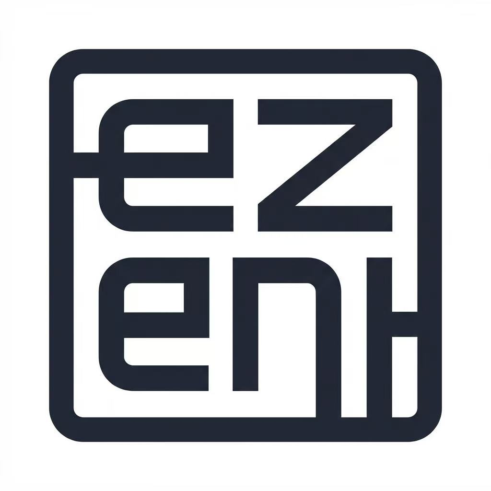

# 滴水湖AI+OPC服务全球挑战赛 2026

复合型开发者竞赛，主赛道与企业命题并行，围绕"AI+OPC"（一人公司）模式展开。
旨在发掘服务全球市场的青年创业者，构建跨境服务技术创新平台，塑造临港全球创新品牌。

活动亮点：
- 复合赛制：主赛道+企业命题并行，满足不同参赛者需求
- 真实场景：联合企业发布真实业务挑战
- 全程数据化：Synnovator平台提供从浏览到获奖的全流程数据支持
- 多路径晋级：支持自动晋级、复活挑战、高门槛直通等多种方式参与决赛

